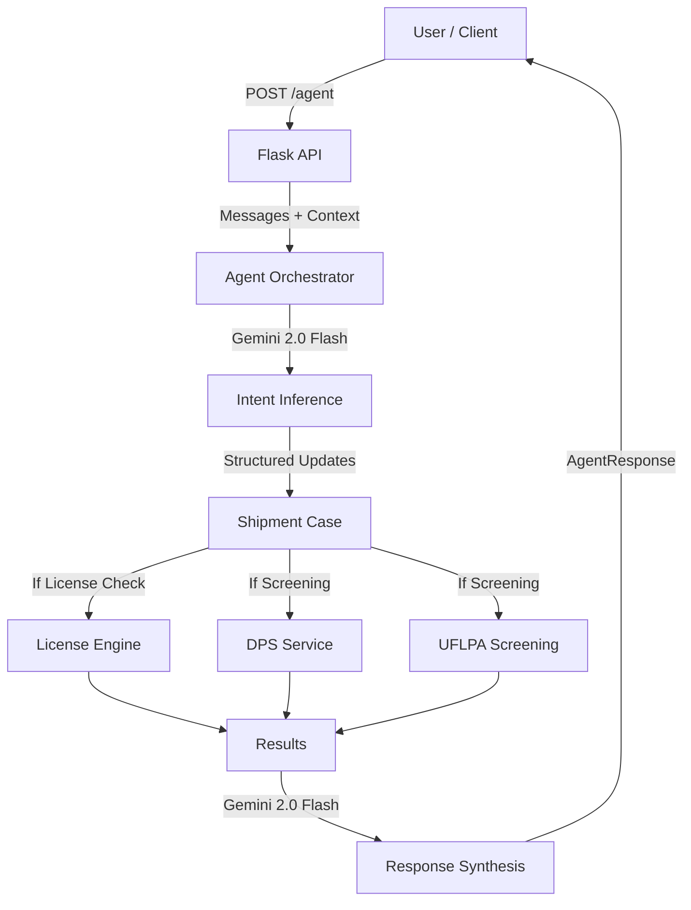

# Agent Architecture & Data Flow

## 1. High-Level Flow

The `/agent` endpoint serves as the central brain for the Export Compliance Assistant. It orchestrates user intent, tool execution, and response synthesis.

## 2. Data Architecture

### Data Models (`backend/data_models.py`)
- **ShipmentCase**: Canonical representation of a shipment (ECCN, Destination, Parties, etc.).
- **LicenseResult**: Structured output from the License Engine (status, exceptions found, trace).
- **ScreeningResult**: Structured output from screening engines (matches, risk level).
- **AgentResponse**: The top-level JSON response containing the updated shipment, natural language message, and tool results.

### Engine Data
- **License Rules**: Hardcoded ECCN definitions in `backend/license_exceptions_engine.py`.
- **Country Groups**: JSON file in `backend/data/country_groups.json`.
- **DPS/UFLPA Lists**: Currently mocked or heuristic-based in their respective services (`dps_service.py`, `forced_labour_screening.py`).

## 3. AI / LLM Architecture

### Model
- **Primary**: Gemini 2.0 Flash (accessed via `google-generativeai` SDK).
- **Role**:
    1. **Intent Inference**: Extracts structured fields (e.g., ECCN, Country) from natural language and determines the user's goal (License Check vs. Screening vs. Q&A).
    2. **Response Synthesis**: summaries technical tool outputs into a human-readable 2-paragraph specific answer.
    3. **General Q&A**: Answers regulatory questions directly if no tools are needed.

### Prompting Strategy
- **Inference**: Uses few-shot or constrained prompting to output pure JSON. Only extracts specific entity types.
- **Synthesis**: Fed with structured tool results (not raw logs) to ensure accuracy. Instructed to be "Professional, non-legal-advice".

## 4. Efficiency & Scaling

- **Statelessness**: The agent is stateless; "Context" is passed in and returned by the client.
- **Selective Execution**: Screening tools only run if relevant fields (Supplier, End User) are present or explicitly requested.
- **Model Choice**: Gemini 2.0 Flash is chosen for low latency.

## 5. Known Limitations

- **ECCN Coverage**: Limited to ~42 key ECCNs.
- **Screening Data**: DPS and UFLPA are currently using mock/heuristic data (e.g., "Huawei" always triggers a match).
- **History**: Chat history context is truncated to the last 3 messages to save tokens.
